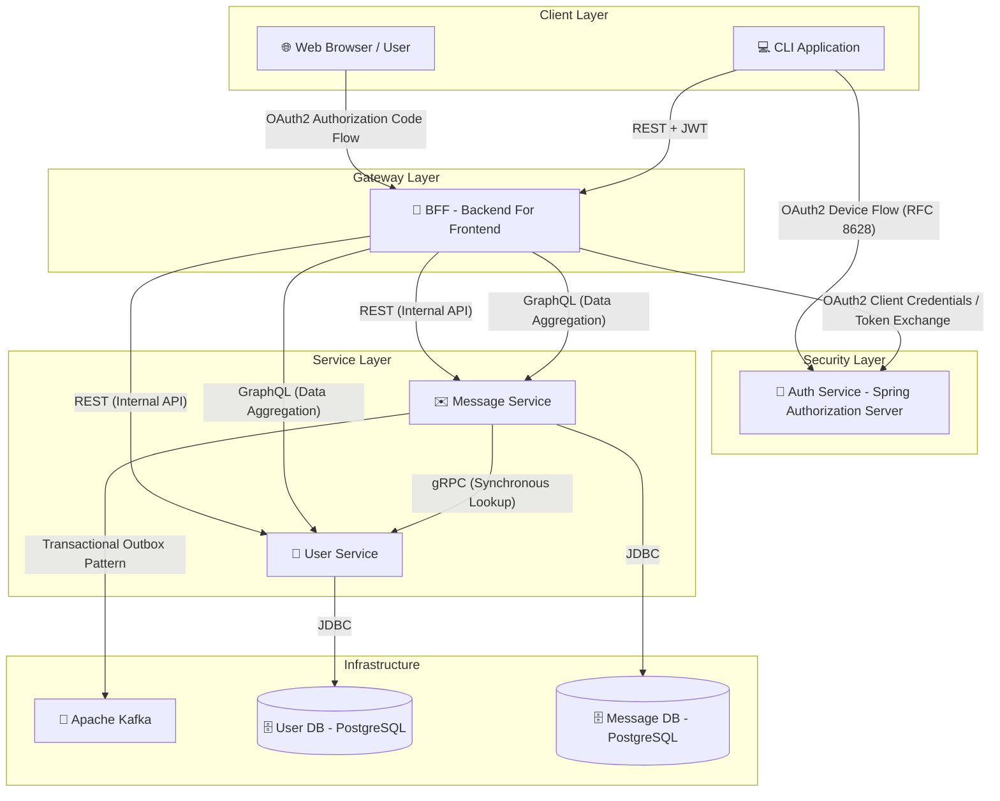

# 🚀 Microservice26 Project

A modern microservices architecture demonstration utilizing **Java 25**, **Spring Boot 4.0**, and various communication patterns including **REST**, **GraphQL**, **gRPC**, and asynchronous messaging with **Kafka** via the **Outbox Pattern**. 🏗️

## 🌐 Project Overview and Architecture

This project consists of a distributed system designed to manage users and messages. It emphasizes security through **OAuth2** and reliability through transactional messaging patterns. 🛡️

### 📊 Architecture Diagram



## 📦 Description of Each Module

### 🔑 authservice
*   **Port:** `9000`
*   **Role:** OAuth2 Authorization Server based on Spring Authorization Server.
*   **Capabilities:**
    *   ✅ Supports `authorization_code` grant for web clients (BFF).
    *   ✅ Supports `device_code` (Device Flow) for the CLI.
    *   ✅ Provides JWT tokens with scopes like `user.read` and `user.write`.
    *   👥 In-memory user management (Demo users: `demo/demo`, `user/password`).

### 🌉 bff (Backend For Frontend)
*   **Port:** `8080`
*   **Role:** An API Gateway and aggregator.
*   **Capabilities:**
    *   🛡️ Acts as an OAuth2 Client and Resource Server.
    *   📡 Provides REST endpoints under `/bff` for user and message management.
    *   🕸️ Provides a GraphQL endpoint at `/graphql` for data aggregation.
    *   ⏩ Handles JWT propagation to downstream services.

### 👥 userservice
*   **Port:** `8081`
*   **Role:** Manages user information.
*   **Capabilities:**
    *   🌐 REST API for CRUD operations on users.
    *   ⚡ gRPC Server (`UserProfileService`) for high-performance internal lookups.
    *   🗄️ Uses PostgreSQL for persistent storage.

### ✉️ messageservice
*   **Port:** `8082`
*   **Role:** Manages messaging between users.
*   **Capabilities:**
    *   📨 REST API for sending and retrieving messages.
    *   🔌 gRPC Client to `userservice` for enriching message data.
    *   📦 Implements the **Transactional Outbox Pattern** for reliable Kafka publishing.
    *   🗄️ Uses PostgreSQL for message storage and the outbox table.

### 💻 cli
*   **Role:** Command-line interface for interacting with the system.
*   **Capabilities:**
    *   🔐 Implements **OAuth2 Device Authorization Flow** (RFC 8628).
    *   🛠️ Interacts with the BFF to perform business operations.

## 🛠️ Technologies Used

*   **☕ Java 25**: Leveraging the latest language features.
*   **🍃 Spring Boot 4.0.6**: Modern application framework.
*   **🔒 Spring Security**: Robust security and OAuth2 implementation.
*   **📡 REST**: Standardized API communication.
*   **🕸️ GraphQL**: Flexible data querying and aggregation.
*   **⚡ gRPC**: Low-latency, contract-first communication.
*   **🎡 Apache Kafka**: Asynchronous event streaming.
*   **🗄️ PostgreSQL**: Reliable relational database storage.
*   **🐳 Docker & Docker Compose**: Containerization and orchestration.
*   **🧪 JUnit 5 & AssertJ**: Comprehensive testing suite.

## 🔐 Authentication Flow (Device Flow)

The CLI uses the Device Authorization Grant, perfect for terminal applications:

1.  **Request:** CLI requests a device code from `authservice`. 📲
2.  **User Action:** User opens a URI in a browser and enters the provided code. 🔑
3.  **Polling:** CLI polls `authservice` for approval status. 🔄
4.  **Token:** `authservice` issues a JWT upon success. 🎟️
5.  **Access:** CLI uses the JWT to call protected BFF endpoints. 🚀

## 📦 Kafka and Outbox Pattern

Ensuring "at-least-once" delivery to Kafka without distributed transactions:

1.  **Transaction:** `Message` and `OutboxEvent` are saved in one DB transaction. 💾
2.  **Polling:** `OutboxPublisher` scans for pending events. 🔍
3.  **Publishing:** Events are sent to Kafka topic `message-published`. 🎡
4.  **Completion:** Event status is updated to `SENT`. ✅

## 🚧 Work in Progress: Kubernetes Implementation

We are currently in the process of migrating our orchestration from Docker Compose to **Kubernetes**. The first service to receive K8s manifests is the `authservice`.

### 🔑 Auth Service K8s Setup
Located in `authservice/k8s/`, you will find:
*   `authservice-deployment.yaml`: Defines the deployment strategy, container image, resource limits, and environment variables.
*   `authservice-service.yaml`: Configures a `ClusterIP` service to provide a stable internal DNS name for the auth server.

This marks the beginning of our transition towards a cloud-native orchestration model. ☁️

## 🚀 Instructions for Running the Project

### 📋 Prerequisites
*   Java 25 SDK
*   Maven
*   Docker & Docker Compose

### 🛠️ Running Locally (Manual)

1.  **Infrastructure:** Start DBs and Kafka:
    ```bash
    docker-compose up -d
    ```
2.  **Services:** Start each module:
    ```bash
    mvn spring-boot:run -pl authservice
    mvn spring-boot:run -pl userservice
    mvn spring-boot:run -pl messageservice
    mvn spring-boot:run -pl bff
    ```

### 🐳 Running with Docker Compose

Start everything at once:
```bash
docker-compose -f docker-compose.yaml -f docker-compose-services.yaml up --build
```

## ⌨️ Example API Calls and CLI Usage

### 💻 CLI Usage
1.  Run: `mvn spring-boot:run -pl cli`
2.  Select **Login** and follow the terminal instructions. 🔑
3.  Enjoy creating users and sending messages! 🎉

### 🕸️ GraphQL (via BFF)
Endpoint: `http://localhost:8080/graphql`
Query example:
```graphql
query {
  merged {
    userservice {
      firstName
      email
    }
    messageservice
  }
}
```

## 🧪 Testing Strategy

*   **Unit Tests:** Component isolation. 🧩
*   **Integration Tests:** `@SpringBootTest` with H2. 🔗
*   **Integrity Tests:** Verifying Outbox Pattern reliability. ⚖️

Run all tests:
```bash
mvn test
```

## 🐳 Docker Packaging and Networking

Each service in this project is fully containerized and includes its own `Dockerfile`. 📦

### 📦 Image Packaging
The services are packaged as Docker images, allowing for consistent deployment across different environments. When running with Docker Compose, each service is built and tagged:
*   `authservice:0.0.1-SNAPSHOT`
*   `bff:0.0.1-SNAPSHOT`
*   `userservice:0.0.1-SNAPSHOT`
*   `messageservice:0.0.1-SNAPSHOT`

### 📡 Internal Communication (DNS)
Within the Docker Compose network, services communicate using **internal DNS names** (the service names defined in the `yaml` files) rather than `localhost`. 🌐

*   **Auth Service:** Accessible at `http://authservice:9000`
*   **User Service:** Accessible at `http://userservice:8081`
*   **Message Service:** Accessible at `http://messageservice:8082`
*   **Kafka:** Accessible at `kafka:9092`
*   **Databases:** Accessible at `userservice-db:5432` and `messageservice-db:5432`

This configuration ensures that the microservices can seamlessly locate and interact with each other in a containerized environment. 🚀
